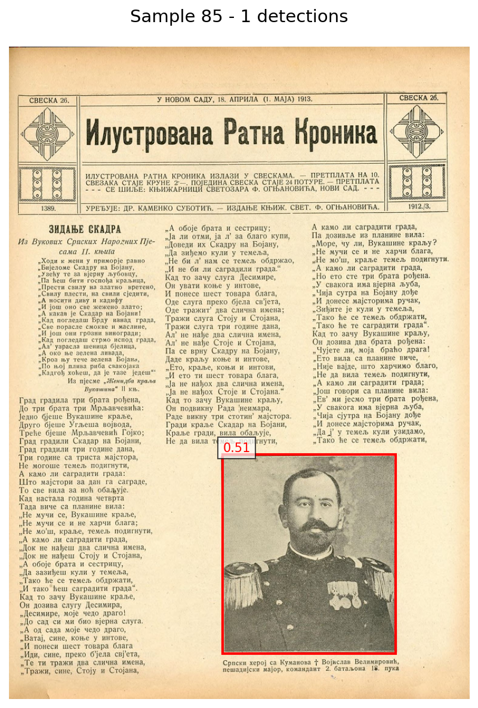
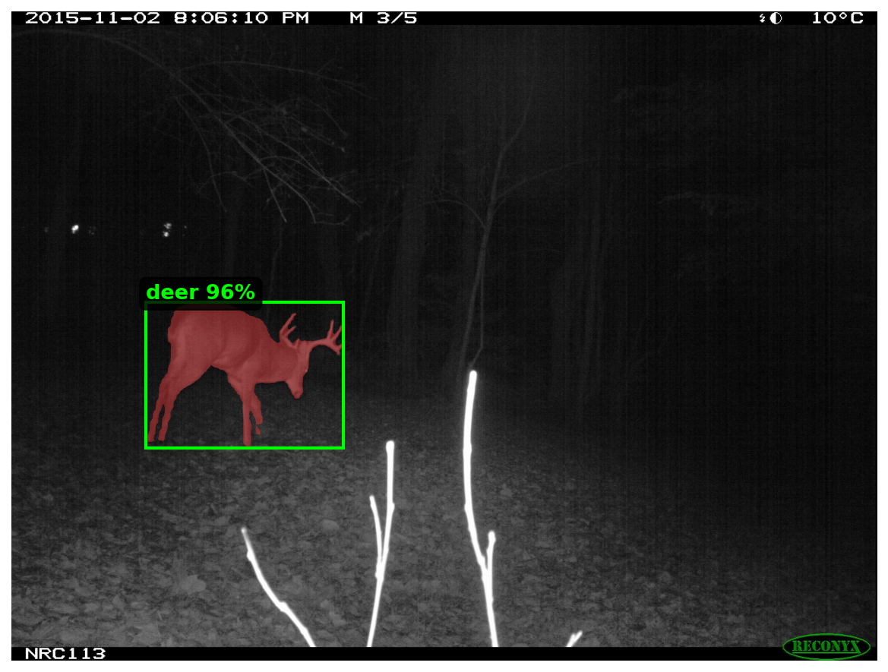

# SAM3 Vision Scripts

Detect and segment objects in images using Meta's **SAM3** (Segment Anything Model 3) with text prompts. Process HuggingFace datasets with zero-shot detection and segmentation using natural language descriptions.

| Script | What it does | Output |
|--------|-------------|--------|
| `detect-objects.py` | Object detection with bounding boxes | `objects` column with bbox, category, score |
| `segment-objects.py` | Pixel-level segmentation masks | Segmentation maps or per-instance masks |

Browse results interactively: **[SAM3 Results Browser](https://huggingface.co/spaces/uv-scripts/sam3-detection-browser)**

---

## Object Detection (`detect-objects.py`)

Detect objects and output bounding boxes in HuggingFace object detection format.

### Quick Start

**Requires GPU.** Use HuggingFace Jobs for cloud execution:

```bash
hf jobs uv run --flavor a100-large \
    -s HF_TOKEN=HF_TOKEN \
    https://huggingface.co/datasets/uv-scripts/sam3/raw/main/detect-objects.py \
    input-dataset \
    output-dataset \
    --class-name photograph
```

### Example Output

<div style="max-width: 400px;">


_Photograph detected in a historical newspaper with bounding box and confidence score. Generated from [davanstrien/newspapers-image-predictions](https://huggingface.co/datasets/davanstrien/newspapers-image-predictions)._

</div>

### Arguments

**Required:**

- `input_dataset` - Input HF dataset ID
- `output_dataset` - Output HF dataset ID
- `--class-name` - Object class to detect (e.g., `"photograph"`, `"animal"`, `"table"`)

**Common options:**

- `--confidence-threshold FLOAT` - Min confidence (default: 0.5)
- `--batch-size INT` - Batch size (default: 4)
- `--max-samples INT` - Limit samples for testing
- `--image-column STR` - Image column name (default: "image")
- `--private` - Make output private

<details>
<summary>All options</summary>

```
--mask-threshold FLOAT       Mask generation threshold (default: 0.5)
--split STR                  Dataset split (default: "train")
--shuffle                    Shuffle before processing
--model STR                  Model ID (default: "facebook/sam3")
--dtype STR                  Precision: float32|float16|bfloat16
--hf-token STR               HF token (or use HF_TOKEN env var)
```

</details>

### Output Format

Adds `objects` column with ClassLabel-based detections:

```python
{
    "objects": [
        {
            "bbox": [x, y, width, height],
            "category": 0,  # Always 0 for single class
            "score": 0.87
        }
    ]
}
```

---

## Image Segmentation (`segment-objects.py`)

Produce pixel-level segmentation masks for objects matching a text prompt. Two output formats available.

### Quick Start

```bash
hf jobs uv run --flavor a100-large \
    -s HF_TOKEN=HF_TOKEN \
    https://huggingface.co/datasets/uv-scripts/sam3/raw/main/segment-objects.py \
    input-dataset \
    output-dataset \
    --class-name deer
```

### Example Output

<div style="max-width: 400px;">


_Deer segmented in a wildlife camera trap image with pixel-level mask and bounding box. Generated from [davanstrien/ena24-detection](https://huggingface.co/datasets/davanstrien/ena24-detection)._

</div>

### Arguments

**Required:**

- `input_dataset` - Input HF dataset ID
- `output_dataset` - Output HF dataset ID
- `--class-name` - Object class to segment (e.g., `"deer"`, `"animal"`, `"table"`)

**Common options:**

- `--output-format` - `semantic-mask` (default) or `instance-masks`
- `--confidence-threshold FLOAT` - Min confidence (default: 0.5)
- `--include-boxes` - Also output bounding boxes
- `--batch-size INT` - Batch size (default: 4)
- `--max-samples INT` - Limit samples for testing
- `--private` - Make output private

<details>
<summary>All options</summary>

```
--mask-threshold FLOAT       Mask binarization threshold (default: 0.5)
--image-column STR           Image column name (default: "image")
--split STR                  Dataset split (default: "train")
--shuffle                    Shuffle before processing
--model STR                  Model ID (default: "facebook/sam3")
--dtype STR                  Precision: float32|float16|bfloat16
--hf-token STR               HF token (or use HF_TOKEN env var)
```

</details>

### Output Formats

**Semantic mask** (`--output-format semantic-mask`, default):
- Adds `segmentation_map` column: single image per sample where pixel value = instance ID (0 = background)
- More compact, viewable in the HF dataset viewer
- Also adds `num_instances` and `scores` columns

**Instance masks** (`--output-format instance-masks`):
- Adds `segmentation_masks` column: list of binary mask images (one per detected instance)
- Also adds `scores` and `category` columns
- Best for extracting individual objects or creating training data

### Example

Segment deer in wildlife camera trap images:

```bash
hf jobs uv run --flavor a100-large \
    -s HF_TOKEN=HF_TOKEN \
    https://huggingface.co/datasets/uv-scripts/sam3/raw/main/segment-objects.py \
    davanstrien/ena24-detection \
    my-username/wildlife-segmented \
    --class-name deer \
    --include-boxes
```

---

## HuggingFace Jobs Examples

### Historical Newspapers

```bash
hf jobs uv run --flavor a100-large \
    -s HF_TOKEN=HF_TOKEN \
    https://huggingface.co/datasets/uv-scripts/sam3/raw/main/detect-objects.py \
    davanstrien/newspapers-with-images-after-photography \
    my-username/newspapers-detected \
    --class-name photograph \
    --confidence-threshold 0.6 \
    --batch-size 8
```

### Wildlife Camera Traps

```bash
hf jobs uv run --flavor a100-large \
    -s HF_TOKEN=HF_TOKEN \
    https://huggingface.co/datasets/uv-scripts/sam3/raw/main/segment-objects.py \
    wildlife-images \
    wildlife-segmented \
    --class-name animal \
    --include-boxes
```

### Quick Testing

Test on a small subset before full run:

```bash
hf jobs uv run --flavor a100-large \
    -s HF_TOKEN=HF_TOKEN \
    https://huggingface.co/datasets/uv-scripts/sam3/raw/main/segment-objects.py \
    large-dataset \
    test-output \
    --class-name object \
    --max-samples 20
```

### GPU Flavors

```bash
# L4 (cost-effective)
--flavor l4x1

# A100 (fastest)
--flavor a100
```

See [HF Jobs pricing](https://huggingface.co/pricing#spaces-compute).

## Local Execution

If you have a CUDA GPU locally:

```bash
# Detection
uv run detect-objects.py INPUT OUTPUT --class-name CLASSNAME

# Segmentation
uv run segment-objects.py INPUT OUTPUT --class-name CLASSNAME
```

## Multiple Object Types

Run the script multiple times with different `--class-name` values:

```bash
hf jobs uv run ... --class-name photograph
hf jobs uv run ... --class-name illustration
```

## Performance

| GPU | Batch Size | ~Images/sec |
| --- | ---------- | ----------- |
| L4  | 4-8        | 2-4         |
| A10 | 8-16       | 4-6         |

_Varies by image size and detection complexity_

## Common Use Cases

- **Documents:** `--class-name table` or `--class-name figure`
- **Newspapers:** `--class-name photograph` or `--class-name illustration`
- **Wildlife:** `--class-name animal` or `--class-name bird`
- **Products:** `--class-name product` or `--class-name label`

## Troubleshooting

- **No CUDA:** Use HF Jobs (see examples above)
- **OOM errors:** Reduce `--batch-size`
- **Few detections:** Lower `--confidence-threshold` or try different class descriptions
- **Wrong column:** Use `--image-column your_column_name`

## About SAM3

[SAM3](https://huggingface.co/facebook/sam3) is Meta's zero-shot vision model. Describe any object in natural language and it will detect and segment it — no training required.

## See Also

- **[SAM3 Results Browser](https://huggingface.co/spaces/uv-scripts/sam3-detection-browser)** - Browse detection and segmentation results interactively
- More UV scripts at [huggingface.co/uv-scripts](https://huggingface.co/uv-scripts)

## License

Apache 2.0
