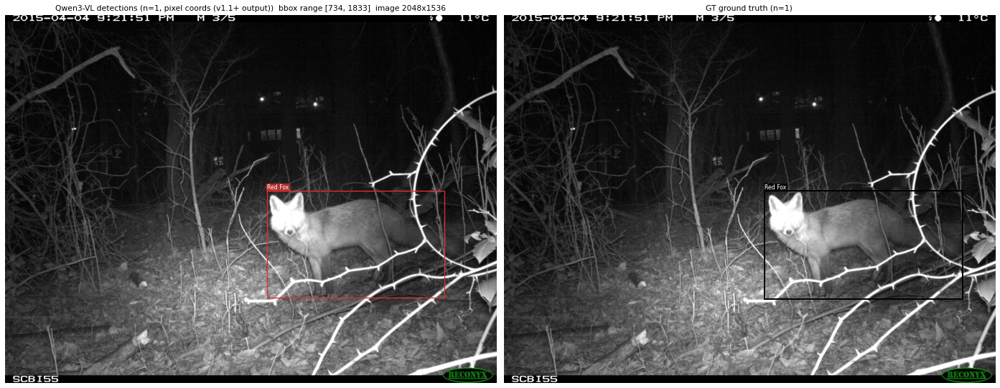

# VLM Object Detection

Instruction-prompted object detection with vision-language models via vLLM. Designed as a **VLM-as-labeller** primitive for bootstrapping object-detection datasets — give it a free-form prompt ("detect every photograph and illustration", "detect all PPE items", "detect every electronic component and identify its reference designator") and it returns bbox JSON ready for downstream labelling tools (Label Studio, FiftyOne, COCO conversion).

**Sibling**: [`uv-scripts/sam3`](https://huggingface.co/datasets/uv-scripts/sam3) does class-prompted detection with SAM3 — pass it `--class-name photograph` and it detects that class. Use SAM3 when you know your classes ahead of time and want speed at scale; use this repo when you want free-form instruction prompts and richer per-element labels (sub-categories, descriptive sub-labels, OCR-style transcription embedded in detections).

| Repo | Prompt style | Output | Best for |
|---|---|---|---|
| `sam3/` | Class names | bbox + score | Known categories, scale |
| `vlm-object-detection/` | Free-form instruction | bbox + label + sub_label | Exploratory labelling, structured per-element labels |

## Scripts

| Script | Status | Use |
|---|---|---|
| `qwen3vl-detect.py` | **Stable** | Standard zero-shot detection |
| `qwen3vl-detect-fewshot.py` | **Experimental** | One-shot in-context example — pass an example image + its labelled output to demonstrate the task |
| `inspect-detections.py` | **Utility** | Render a side-by-side PNG of model detections vs ground truth (when source has GT) for each row of an output dataset. Used to generate all visual comparisons in this README. |

The script name says `qwen3vl` because the bbox-output convention (`bbox_2d` JSON normalised to 0-1000) is the Qwen-VL family standard, but the script is mostly model-agnostic — you can pass any vLLM-supported VLM via `--model` and adjust the prompt accordingly.

## Quick start

```bash
hf jobs uv run \
  --image vllm/vllm-openai:latest \
  --flavor a100-large \
  --python /usr/bin/python3 \
  -e PYTHONPATH=/usr/local/lib/python3.12/dist-packages \
  -s HF_TOKEN \
  https://huggingface.co/datasets/uv-scripts/vlm-object-detection/raw/main/qwen3vl-detect.py \
  INPUT_DATASET OUTPUT_DATASET \
  --model Qwen/Qwen3.6-35B-A3B \
  --max-model-len 32768 \
  --max-image-tokens 9800 \
  --gpu-memory-utilization 0.90 \
  --max-samples 20 --shuffle --seed 42 \
  --prompt "Detect every visible object. For each, return a JSON object with bbox_2d (normalised 0-1000), label, and sub_label."
```

**Recommended model right now**: `Qwen/Qwen3.6-35B-A3B`. It has the strongest detection benchmarks of the Qwen-VL family (ODInW13 zero-shot detection 50.8) and produces labelling-grade boxes on natural images. As newer VLMs land we expect to update this recommendation; the script's defaults will be revisited then.

## Output schema

Each row of the output dataset gets three new columns:

- **`detections`**: `list[{bbox: [x1, y1, x2, y2], label: str, sub_label: str}]`
  - **`bbox`** is in **original-image pixel coordinates** (integers, clipped to image bounds). The script denormalises the model's 0-1000 output internally.
- **`raw_response`**: full model text (for re-parsing, debugging, audit)
- **`inference_info`**: JSON string with model, prompt, image_size, min/max pixels, timestamp

All original input columns are preserved.

## Detection prompt format

Qwen-VL family models emit bbox JSON when prompted with the `bbox_2d` / `label` / `sub_label` schema. The script parses that JSON robustly (tolerates fenced code blocks, trailing commas, comments).

A working prompt template:

```
Detect every {target description}. For each, return a JSON object with
"bbox_2d": [x1, y1, x2, y2] (coordinates normalised to 0-1000),
"label" ({category constraints — list classes, or just "the object category"}),
and "sub_label" ({what to put in sub_label, e.g. colour, sub-category, transcribed text}).
Return a JSON array.
```

Empirical lessons:

- **Enumerate the class set in the prompt** when you have one. Listing the 23 ENA24 species or the 5 CPPE-5 PPE classes explicitly in the prompt constrains the model's label vocabulary and cuts class drift (e.g. "Squirrel" vs "Eastern Gray Squirrel").
- **Keep prompts positive-only.** Telling the model what to *find* works better than "ignore X" clauses, which can trigger over-conservative empty outputs on busy pages.
- **Give the model a broad taxonomy and filter the output post-hoc** rather than narrowing the prompt. Asking for 7 categories then `label in {"Photograph", "Illustration"}` produces better detections on the categories you care about than asking for just those 2 classes upfront.
- **Sub-labels are descriptive prose**, not constrained. The model uses them for colour ("blue nitrile"), material ("white N95 respirator"), behaviour/posture, reference designators ("R246", "U201"), or transcribed text (actual headline text on a newspaper page).

### Example prompts used in the worked examples

The exact prompt strings that produced the example datasets below — copy and adapt:

**Wildlife (ENA24, 23 species):**
```
Detect every distinct animal, person, or vehicle visible in this camera trap photo.
For each, return a JSON object with "bbox_2d": [x1, y1, x2, y2] (coordinates normalised
to 0-1000), "label" (one of: Bird, Eastern Gray Squirrel, Eastern Chipmunk, Woodchuck,
Wild Turkey, White_Tailed_Deer, Virginia Opossum, Eastern Cottontail, Human, Vehicle,
Striped Skunk, Red Fox, Eastern Fox Squirrel, Northern Raccoon, Grey Fox, Horse, Dog,
American Crow, Chicken, Domestic Cat, Coyote, Bobcat, American Black Bear), and
"sub_label" (a short description, e.g. behaviour, posture, or partial-visibility note).
Return a JSON array.
```

**Medical PPE (CPPE-5, 5 classes):**
```
Detect every piece of medical personal protective equipment (PPE) visible in this
image. For each, return a JSON object with "bbox_2d": [x1, y1, x2, y2] (coordinates
normalised to 0-1000), "label" (exactly one of: Coverall, Face_Shield, Gloves,
Goggles, Mask), and "sub_label" (a short colour or material descriptor). Return a
JSON array. Each object must be a distinct visible item; do not return overlapping
or duplicate boxes.
```

**Historical newspapers (Beyond Words, 7 classes):**
```
Detect every distinct visual element on this historical newspaper page. For each,
return a JSON object with "bbox_2d": [x1, y1, x2, y2] (coordinates normalised to
0-1000), "label" (one of: Photograph, Illustration, Map, Comics/Cartoon, Editorial
Cartoon, Headline, Advertisement), and "sub_label" (a short description of the
content). Return a JSON array. Each object must be a distinct visible region; do
not return overlapping or duplicate boxes.
```

## Hardware notes

- **A100-large + `vllm/vllm-openai:latest` image** is the working combo. The default uv-script image installs PyPI's latest PyTorch, which has a CUDA driver mismatch on a100 hosts (driver 12.9, PyTorch wants newer). Workaround: `--image vllm/vllm-openai:latest --python /usr/bin/python3 -e PYTHONPATH=/usr/local/lib/python3.12/dist-packages` (uses the image's pre-installed driver-compatible torch + vllm).
- **H200 was unreliable** in our testing — flashinfer's runtime JIT compile of cutlass kernels for `compute_90a` failed in the same image. Stick with A100 for now.
- **`max_num_seqs` is auto-capped to `batch_size`**. Qwen3.6's hybrid Gated-DeltaNet architecture allocates per-sequence SSM cache blocks; vLLM's default 256 can exceed available blocks and crash CUDA graph capture. We never decode > batch_size concurrently anyway.

## CLI reference

Run `uv run qwen3vl-detect.py --help` for the full flag set. Most-tuned flags:

- `--prompt` / `--prompt-file` — the detection instruction
- `--model` — any vLLM-supported VLM. Default: `Qwen/Qwen3.6-35B-A3B`. For smaller GPUs use `Qwen/Qwen3.5-9B` and lower `--max-model-len` / `--max-image-tokens`.
- `--image-column` (default: `image`)
- `--split` (default: `train`)
- `--max-samples`, `--shuffle`, `--seed` — for test/exploration runs
- `--batch-size` (default: 8)
- `--max-tokens` (default: 8192) — output cap; bump if outputs get truncated
- `--max-model-len`, `--max-image-tokens`, `--gpu-memory-utilization` — VRAM tuning
- `--repetition-penalty` (default: 1.05) — prevents the "100 duplicate detections" failure mode
- `--grayscale` — convert input to L channel then RGB; sometimes helps on sepia/discoloured historical scans
- `--private`, `--create-pr` — output dataset visibility / commit mode

## Worked examples



*Zero-shot detection on `davanstrien/ena24-detection` (camera-trap wildlife) — left panel shows the model's `Red Fox` prediction with a tight box; right shows ground truth at the same coordinates. See [`davanstrien/qwen3.6-ena24-20samples`](https://huggingface.co/datasets/davanstrien/qwen3.6-ena24-20samples) for the full 20-row output dataset.*

These public datasets were generated with the recommended config (Qwen3.6-35B-A3B on a100-large via vllm/vllm-openai:latest, 20 sampled rows each, shuffle seed 42) and can be inspected as reference:

| Output dataset | Source | Prompt | Headline result |
|---|---|---|---|
| `davanstrien/qwen3.6-ena24-20samples` | `davanstrien/ena24-detection` (camera-trap wildlife, 23 species) | List the 23 species + "detect every animal, person, or vehicle" | **20/20 exact detection-count match, 16/20 exact species match** — species confusion was on similar small-mammals (Grey Fox↔Red Fox, Eastern Chipmunk↔Eastern Gray Squirrel) and one Bobcat→squirrel error |
| `davanstrien/qwen3.6-cppe5-20samples` | `rishitdagli/cppe-5` (medical PPE photos, 5 classes) | Detect Coverall/Face_Shield/Gloves/Goggles/Mask | Labelling-grade boxes (within ~10 px of GT on most items). Descriptive sub-labels ("white N95 respirator", "blue nitrile") |
| `davanstrien/qwen3.6-beyond-words-20samples` | `biglam/loc_beyond_words` (WW1-era newspapers, 7 classes) | Detect Photograph/Illustration/Map/Comics/Editorial Cartoon/Headline/Advertisement | Mixed — clean per-element detection on most pages, occasional empty output on the densest layouts. Notable: `sub_label` often contains transcribed headline text |

## Inspecting outputs

`inspect-detections.py` renders side-by-side PNGs of model detections vs ground truth (when available) so you can eyeball quality before trusting the dataset. Runs locally (no GPU needed) — installs matplotlib + datasets via uv on first invocation.

```bash
uv run https://huggingface.co/datasets/uv-scripts/vlm-object-detection/raw/main/inspect-detections.py \
    davanstrien/qwen3.6-ena24-20samples \
    --split train \
    --source davanstrien/ena24-detection \
    --source-split train \
    --max-rows 20
```

The `--source` flag is optional but recommended when the source dataset has bbox ground truth — the script will read the source's `objects.category` ClassLabel feature to recover human-readable class names (which get stripped from the output dataset's features on `push_to_hub` round-trip). Without `--source`, only the model detections panel is rendered.

PNGs are written to `/tmp/<output-slug>-viz/` by default (override with `--out-dir`). Each file is `row{i}_id{image_id}.png`. Per-row text summary (detection counts, label histogram, bbox value range) is printed to stdout.

## Known limitations

- **Bbox precision varies by model and image.** On natural-object photos (PPE, products, animals), boxes are often within 10 px of ground truth. On dense document layouts, boxes are looser and occasionally model gives up on a page entirely.
- **Output is "labelling-grade" not "training-grade".** Useful as a step-zero seed for a labelling pipeline (export to Label Studio / FiftyOne for human review/correction), not as final ground truth.
- **Dense layouts (newspapers, magazine pages)**: the model occasionally returns empty or over-detects. Mitigations: keep prompts positive-only, use a broad taxonomy + post-filter, try `qwen3vl-detect-fewshot.py` with a representative example.

## Few-shot variant

`qwen3vl-detect-fewshot.py` adds two flags:

- `--example-image PATH` — a single image to use as the in-context demonstration
- `--example-answer-file PATH` — a text file containing the expected JSON output for that image (the script reads it verbatim and inlines it in the prompt)

When both are set, each target image is preceded by the example + its answer in a single user-turn message. Boosts precision on rows where it fires, at the cost of lower recall (more empty outputs on pages that don't look like the example).

In HF Jobs, pass example artifacts via volume mount:

```bash
-v hf://datasets/your-namespace/your-example-dataset:/example \
--example-image /example/example.png \
--example-answer-file /example/answer.json
```

Pick an example that looks similar to your typical target page — the model anchors heavily to "what a page should look like."

## Acknowledgements

Adapted from the [`Qwen/Object-Detection-with-Qwen`](https://modelscope.cn/studios/Qwen/Object-Detection-with-Qwen) demo on ModelScope. The Qwen-VL family is from Alibaba's Qwen team; weights are available on Hugging Face under apache-2.0.
